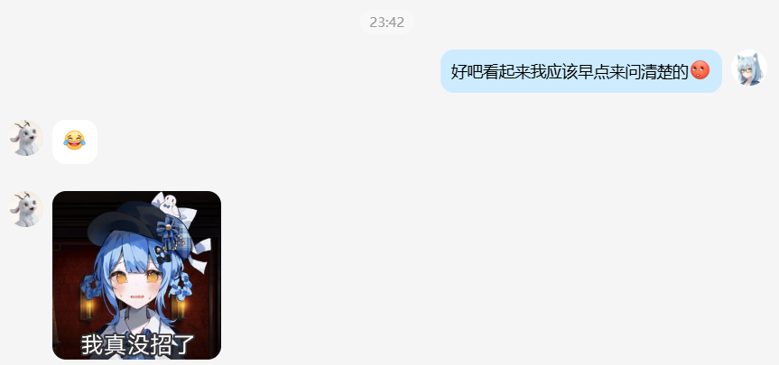

## 关于107.ustc.edu.cn集群和AI课程实验的若干问题
* 集群有两个分区，但永远只有一个可用，并且不会自动帮你调一个可用的
* 创建VSCode/作业/其它应用时默认是16个加速卡，然后就会报错`QOSMaxGRESPerUser`
  - 只用GUI不能改出加速卡<16，必须手写命令行参数
* 不管什么问题永远是`QOSMaxGRESPerUser`，不告诉你具体什么资源超了你就慢慢猜吧
  - 每猜一个问题都得重新提交，等几分钟排队，然后看有没有再报错
* 不能同时存在一个VSCode应用和一个作业；而且报错tmd依然是`QOSMaxGRESPerUser`
  - 那怎么同时写代码和运行？一个答案是手册上不会教你的可能并不在正常使用范围内的SSH连接
    * 这还能避免创建VSCode应用时Running之后可能要额外等3~5分钟初始化的问题
    * 据我所知没有上相关课程的同学是不会知道自己的密码的，所以用不了这个
    * 代价是这样调用不了GPU资源（不是什么大问题）
* 作业有“保存为模板”的选项，但是不会保存自定义的工作目录
* 自己安装的`conda`，在自己的命令行上用着很正常，但作业里用就会找不到命令
  - 试过手动`source .bashrc`加载但没用
  - 自己用绝对路径引用？等着报错`CondaError: Run 'conda init' before 'conda activate'`吧
  - 那就自己手动`xxx/conda init`？一样报错
  - 正确做法是用绝对路径引用`python`
* 终于能开始跑python代码了？错了，你会发现作业不给`requirements`根本调不好依赖
  - 如果用的`torch`版本太新，提供的代码会跑不起来
  - 那就找助教要一份可用的依赖列表？结果就是库版本又太旧了配不上集群高贵的RTX 5090
  - 神奇的是在助教的进一步帮助之下我奇迹般地配好了依赖
  - ……并没有。事实上是因为我下载到了非CUDA版本的torch所以根本没调用到GPU
  - 如果你也卡住了，可以参考这个仓库下面的`requirements.yaml`；但我不保证可用
* 什么叫训练集上错误率30%但是测试集100%是正常结果？（准确地说，是祖传代码中存在的一个问题导致的）
  - 于是我浪费了几个小时在这种毫无意义的事情上
  - 助教：
* 最后我要说这个实验的优点：*假如*没有上面这么多集群、python环境以及祖传BUG的烦心事，这是一个极其简单的代码实验——第一个文件只有几处填空，第二个只有3处，填完之后跑一遍就能完成
  - 这就导致，完成实验的过程中真正能学到东西的时间可能只有不到1h，剩下的（可能前后持续几天的时间）全是在和本可以不存在的障碍斗智斗勇